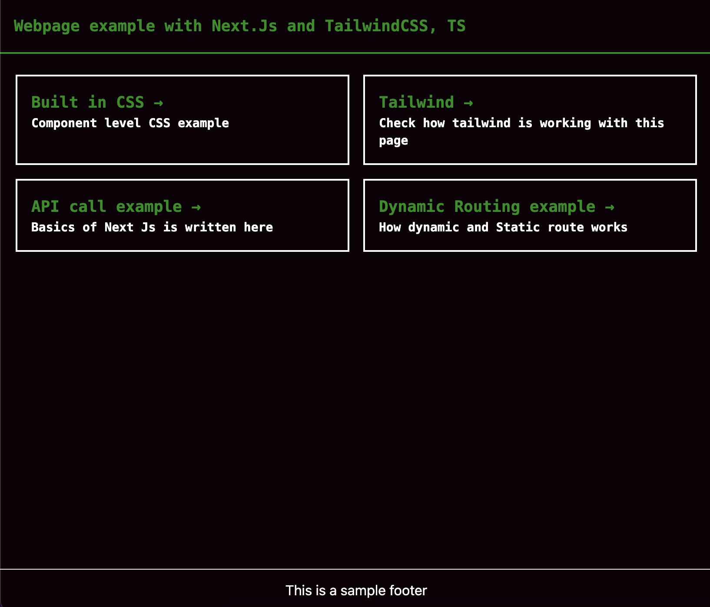

<h1 align="center"> Next JS version 12 + TailwindCSS 3 and Typescript project</h1>
### Contents:
- [Contents:](#contents)
- [Project stack](#project-stack)
  - [Requirements](#requirements)
  - [How to run](#how-to-run)
  - [Features](#features)
  - [Project structure](#project-structure)
  - [Additional information related to structure and Next.js](#additional-information-related-to-structure-and-nextjs)
    - [Images and assets](#images-and-assets)
    - [Styles](#styles)
  - [Packages](#packages)
    - [Packages for styling](#packages-for-styling)
    - [Packages for code styling](#packages-for-code-styling)


Open [http://localhost:3000](http://localhost:3000) with your browser to see the result.

You can start editing the page by modifying `pages/index.tsx`. The page auto-updates as you edit the file.

[API routes](https://nextjs.org/docs/api-routes/introduction) can be accessed on [http://localhost:3000/api/hello](http://localhost:3000/api/hello). This endpoint can be edited in `pages/api/hello.ts`.

The `pages/api` directory is mapped to `/api/*`. Files in this directory are treated as [API routes](https://nextjs.org/docs/api-routes/introduction) instead of React pages.

---
### Project stack
This project is using TypeScript and Sass, TailwindCss.  And it includes example of basic functions and feature's usage.


--------------------------------
#### Requirements
Node.js 14+ and npm

#### How to run

Run the development server:

```bash
npm run dev
# or
yarn dev
```
#### Features
- Next generation React Framework [Next.js](https://nextjs.org)
- Type checking with [TypeScript](https://www.typescriptlang.org)
- Clean CSS writing with [Tailwind CSS](https://tailwindcss.com)
- Lint, Prettier and TypeScript etc configurations
- Unit testing with Jest
- E2E testing with Cypress

#### Project structure

```
.
├── README.md                       # README file
├── .vscode                         # VSCode configuration
├── public                          # Public assets folder
├── src
│   ├── pages                       # Next JS Pages
│   ├── styles                      # Styles folder
│   └── utils                       # Utility functions
│   └── store                       # Redux, state management
│   └── services                    # Services, api calls.
├── tailwind.config.js              # Tailwind CSS configuration
└── tsconfig.json                   # TypeScript configuration
```

#### Additional information related to structure and Next.js
##### Images and assets
Images are inside `images` directory inside of `public` directory.
> Next.js provides `Image` component, which automatically handle image lazy loading and responsive image for different screens. 

##### Styles
- CSS modules: CSS modules locally scope CSS by automatically creating uniq class name. This allows us to use the same CSS class name in different files. CSS modules are located inside *** directory and can be imported anywhere.
- Global stylesheet: Base CSS loaded by every page. It(`globals.scss`) located inside styles directory.

---
#### Packages
##### Packages for styling
- tailwind + postcss
- Sass
##### Packages for code styling
- classnames
`classnames` is a simple library that lets you toggle class names easily.